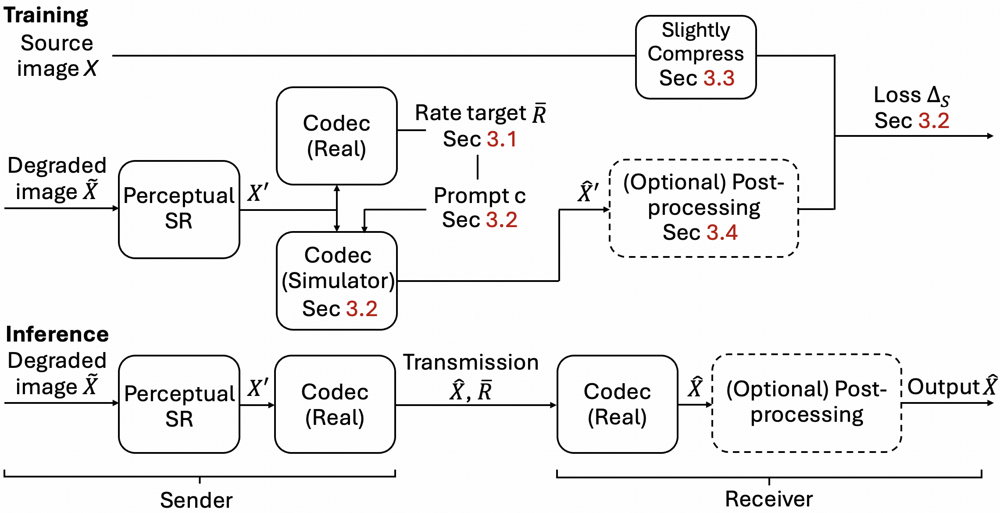
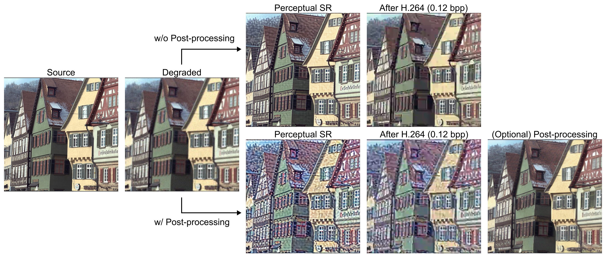
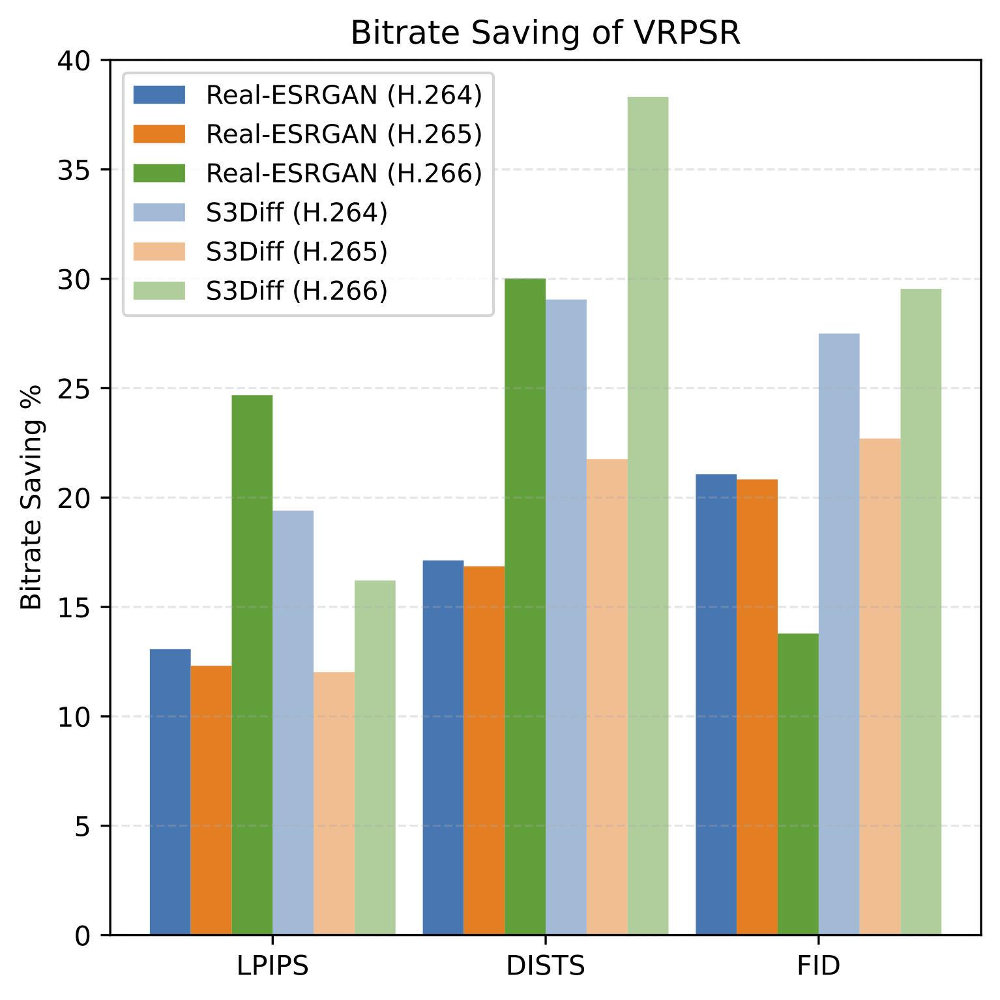

# VRPSR: Versatile Recompression-Aware Perceptual Image Super-Resolution

<p align="center">
  <a href="https://arxiv.org/abs/XXXX.XXXXX">
    
  </a>
  <a href="https://huggingface.co/agus-official/vrpsr-checkpoints">
    
  </a>
  
  
  <a href="#-license">
    
  </a>
</p>

<p align="center">
  <b>Make your perceptual SR models aware of the codec that comes after them.</b><br/>
  <sub>Optimized for post-codec visual quality under H.264 / H.265 / H.266.</sub>
</p>

<p align="center">
  
</p>

<p align="center">
  <em>
    In real systems, images are restored, <strong>then</strong> recompressed.
    VRPSR trains SR models for what the viewer actually sees: the <strong>recompressed</strong> image.
  </em>
</p>

---

> **Paper:** Versatile Recompression-Aware Perceptual Image Super-Resolution  
> **Code:** https://github.com/agus-official/VRPSR  
> **Checkpoints:** https://huggingface.co/agus-official/vrpsr-checkpoints  

---

## 🔗 Table of Contents

- [🚀 TL;DR](#-tldr)
- [🧩 What is VRPSR?](#-what-is-vrpsr)
- [📦 Project Status](#-project-status)
- [🧠 Method Overview](#-method-overview)
- [⚙️ Installation & Setup](#%EF%B8%8F-installation--setup)
- [💾 Pretrained Checkpoints](#-pretrained-checkpoints)
- [🌫 Base Diffusion Model (`sd_path`)](#-base-diffusion-model-sd_path)
- [🧱 C++ Codec Wrapper](#-c-codec-wrapper)
- [🏁 Quickstart: One-Line Scripts](#-quickstart-one-line-scripts)
- [💻 CLI Usage Examples](#-cli-usage-examples)
- [📚 Citation](#-citation)
- [📜 License](#-license)
- [🤝 Acknowledgements](#-acknowledgements)

---

## 🚀 TL;DR

In many real-world pipelines, images go through:

> **LR input → Perceptual SR → H.264/H.265/H.266 compression → Viewer**

Most SR models optimize only the **pre-compression** output, ignoring the codec that follows.

**VRPSR** makes existing perceptual SR models **recompression-aware** and **codec-aware** by:

- Learning a **differentiable codec simulator** built on a powerful diffusion model,
- Conditioning SR on **codec type** and **target bitrate / QP**,  
- Training SR to directly optimize the **post-codec** perceptual quality.

This repo provides **inference code + pretrained models** for VRPSR, ready to plug into your pipeline.

---

## 🧩 What is VRPSR?

Perceptual image SR (e.g., Real-ESRGAN, S3Diff) produces sharp images from degraded inputs, but in practice these images are **recompressed** for storage or distribution. Without recompression-awareness:

- Fine details from SR can be turned into codec artifacts,
- Bitrate is wasted on details the codec will destroy anyway,
- Different codecs / settings (H.264/H.265/H.266, various QP/bpp) behave very differently.

**VRPSR (Versatile Recompression-Aware Perceptual SR)** is a framework that:

- Treats **compression as a conditional text-to-image task**,  
- Uses a **pre-trained diffusion model** to build a **codec simulator** conditioned on codec type + target bitrate,  
- Trains SR models **through** this simulator to optimize post-codec quality.

Key ideas and training tricks include:

- **Rate-target simulator**: directly predicts the post-codec image at a desired bitrate (bpp), instead of approximating internal codec parameters,
- **Perceptual training target** for the simulator (LPIPS/DISTS/FID-oriented), not just MSE,
- **Slightly compressed supervision** for SR (clean-but-realistic targets),
- **Two-stage optimization** (simulator first, then SR through a frozen simulator),
- **No STE** (Straight-Through Estimator) — we find using the simulator output directly works better.

Empirically, VRPSR:

- Saves **10–40% bitrate** at matched perceptual quality (LPIPS/DISTS/FID),
- Works across **Real-ESRGAN** (GAN-based) and **S3Diff** (diffusion-based),
- Handles **H.264 / H.265 / H.266** over a wide bitrate range.

---

## 📦 Project Status

> ✅ Available in this repo · ⏳ Planned / WIP

- ✅ **Inference code** for:
  - VRPSR **codec simulator**
  - VRPSR-enhanced SR backbones:
    - 🌀 **Diffusion-based SR** (S3Diff-style)
    - 🐼 **GAN-based SR** (Real-ESRGAN-style)
  - Optional **post-processing / “sandwich”** variant:
    > Pre-SR → Codec → Post-SR
- ✅ **Pretrained checkpoints**  
  → Hosted on Hugging Face:  
  https://huggingface.co/agus-official/vrpsr-checkpoints
- ⏳ **Training code**  
  Planned for public release in a future update.

---

## 🧠 Method Overview

<p align="center">
  
</p>

At a high level, VRPSR consists of three parts:

### 1️⃣ Diffusion-Based Codec Simulator

- Trained to mimic real codecs (**H.264 / H.265 / H.266**) at different bitrates,
- Formulated as **conditional text-to-image generation**:
  - Input: SR output image + “codec prompt” (codec type, bpp),
  - Output: post-codec reconstruction,
- Built on a **distilled Stable Diffusion / S3Diff-style** backbone,
- Fully **differentiable**, so gradients flow through the codec stage during training.

### 2️⃣ Codec-Aware SR Backbones

We equip existing SR models with codec-awareness:

- 🌀 **S3Diff-style diffusion SR**  
- 🐼 **Real-ESRGAN-style GAN SR**

Both are conditioned on:

- Codec type (e.g. `libx264`, `libx265`, `vvenc`),
- Target bitrate or QP.

Conditioning is injected via **codec embeddings** (similar to time embeddings / AdaIN).

### 3️⃣ Optional “Sandwich” Variant (Pre-SR → Codec → Post-SR)

To further improve robustness at low bitrate, VRPSR also supports:

> **Pre-SR → Codec (real or simulated) → Post-SR**

- **Pre-SR** prepares the image for compression,
- **Post-SR** removes residual codec artifacts,
- Both can be **jointly optimized** through the differentiable simulator.

<p align="center">
  
</p>

---

## 📈 Performance Highlights
<p align="center">
  
</p>
<p align="center"><em>VRPSR consistently saves more than 10% bitrate across codecs (H.264/H.265/H.266) and SR backbones.</em></p>

## ⚙️ Installation & Setup

### 1. Clone the repo & init submodules

```bash
git clone https://github.com/agus-official/VRPSR.git
cd VRPSR
git submodule update --init --recursive
```

### 2. Python & PyTorch environment

We recommend:

- **Python** ≥ 3.8 (experiments used 3.8.10),
- A **CUDA GPU** with ≥ 12 GB VRAM.

Example with `conda`:

```bash
conda create -n vrpsr python=3.8 -y
conda activate vrpsr
```

Install **PyTorch** for your system (see official PyTorch instructions), then:

```bash
pip install -r requirements.txt
```

------

## 💾 Pretrained Checkpoints

All VRPSR checkpoints live on **Hugging Face**:

> https://huggingface.co/agus-official/vrpsr-checkpoints

Right after cloning the repo, you should:

### Option A — Download manually

Download the files into `VRPSR/checkpoints/`:

```text
VRPSR/checkpoints/
  de_net.pth
  simulator.pkl
  vrpsr_s3diff.pkl
  vrpsr_realesrgan.pkl
  pre_sr.pkl
  post_sr.pkl
```

### Option B — With `git lfs`

```bash
cd VRPSR
git lfs install

git clone https://huggingface.co/agus-official/vrpsr-checkpoints hf_ckpts
cp hf_ckpts/checkpoints/* checkpoints/
```

> If you use a different folder layout, just point the CLI flags
>  (`--de_net_path`, `--pretrained_*_path`) to your custom paths.

------

## 🌫 Base Diffusion Model (`sd_path`)

The VRPSR simulator and SR models build on a **base diffusion model** (e.g., S3Diff / distilled Stable Diffusion).

All inference scripts accept:

```bash
--sd_path /path/to/your/base_diffusion_model
```

You can:

1. **Prepare `sd_path` yourself**
   - Download a compatible base model checkpoint,
   - Reuse it across runs for faster startup and offline use.
2. **Let the script auto-download**
   - If `--sd_path` is omitted, scripts try to **auto-download** the default base model,
   - Requires network access and more time on first run.

If unsure, start with auto-download once, then cache via `--sd_path`.

------

## 🧱 C++ Codec Wrapper

The Python scripts call a C++ shared library for efficient codec operations.

### 1. Build the shared library

From repo root:

```bash
cd VRPSR
cd cpp
mkdir build && cd build
cmake ../
make -j
```

After building, you should see something like:

```text
VRPSR/cpp/build/codecsimulator.cpython-38-x86_64-linux-gnu.so
```

> Prefix `codecsimulator` and suffix `.so` are fixed;
>  the middle part depends on Python version & platform.

### 2. Make it visible to Python

Copy the generated `.so` into `src/`:

```bash
cd VRPSR  # repo root

cp cpp/build/codecsimulator*.so src/
```

Now Python can import the codec wrapper.

------

## 🏁 Quickstart: One-Line Scripts

We provide convenience scripts under `scripts/`. Run them from `VRPSR/`:

```bash
# Codec simulator vs real codec
bash scripts/inference_sim.sh

# VRPSR with diffusion-based SR (S3Diff-style)
bash scripts/inference_sr_s3diff.sh

# VRPSR with GAN-based SR (Real-ESRGAN-style)
bash scripts/inference_sr_realesrgan.sh

# Full sandwich pipeline: Pre-SR → Codec → Post-SR
bash scripts/inference_post.sh
```

These assume:

- Checkpoints in `checkpoints/`,
- Test images in `datasets/kodak/` (PNG/JPEG),
- `codecsimulator*.so` copied into `src/`,
- Optional `--sd_path` set inside the scripts (or omitted for auto-download).

Feel free to copy & modify them for your own datasets/codecs/QPs.

------

## 💻 CLI Usage Examples

All examples below use **one GPU** via `accelerate`:

> You may need to run `accelerate config` once to create a default config.

> Note: all commands accept `--sd_path /path/to/base_diffusion_model`.
>  If omitted, the script auto-downloads the default base model.

------

### 1️⃣ Codec Simulator Inference

Approximate the effect of a real codec:

```bash
cd VRPSR

accelerate launch \
  --num_processes=1 \
  --gpu_ids "0" \
  --main_process_port 29300 \
  src/inference_sim.py \
  --de_net_path checkpoints/de_net.pth \
  --pretrained_path checkpoints/simulator.pkl \
  --ref_path datasets/kodak \
  --output_dir result_sim/sim \
  --rec_save_dir result_sim/real \
  --fixed_codec_type libx264 \
  --fixed_qp 33
  # Optional:
  # --sd_path /path/to/sd-base
```

Key args:

- `--ref_path` : input images (PNG/JPEG),
- `--fixed_codec_type` : target codec (`libx264`, `libx265`, `vvenc`, …),
- `--fixed_qp` : QP (e.g., 22/27/32/37),
- `--output_dir` : outputs from the **simulator**,
- `--rec_save_dir` : outputs from the **real codec** for comparison.

Use this to study **simulator fidelity** and perform “what-if” experiments.

------

### 2️⃣ VRPSR + Diffusion-Based SR (S3Diff-style)

Run VRPSR-enhanced SR with a diffusion backbone:

```bash
accelerate launch \
  --num_processes=1 \
  --gpu_ids "0" \
  --main_process_port 29300 \
  src/inference_sr.py \
  --de_net_path checkpoints/de_net.pth \
  --pretrained_sr_path checkpoints/vrpsr_s3diff.pkl \
  --model s3diff \
  --ref_path datasets/kodak \
  --fixed_codec_type libx264 \
  --fixed_qp 32 \
  --output_dir result_sr_s3diff \
  --output_combined_dir result_sr_s3diff_collage
  # Optional:
  # --sd_path /path/to/sd-base
```

Notes:

- `--model s3diff` selects the diffusion SR backbone,
- `--output_combined_dir` saves collages for quick qualitative inspection.

This corresponds to **“VRPSR (S3Diff)”** in the paper.

------

### 3️⃣ VRPSR + GAN-Based SR (Real-ESRGAN-style)

Run VRPSR with a GAN backbone:

```bash
accelerate launch \
  --num_processes=1 \
  --gpu_ids "0" \
  --main_process_port 29300 \
  src/inference_sr.py \
  --de_net_path checkpoints/de_net.pth \
  --pretrained_sr_path checkpoints/vrpsr_realesrgan.pkl \
  --model realesrgan \
  --ref_path datasets/kodak \
  --fixed_codec_type libx264 \
  --fixed_qp 32 \
  --output_dir result_sr_realesrgan \
  --output_combined_dir result_sr_realesrgan_collage
  # Optional:
  # --sd_path /path/to/sd-base
```

Interface is identical to the diffusion case — only the backbone & checkpoint differ.

------

### 4️⃣ “Sandwich” Variant: Pre-SR → Codec → Post-SR

Use both pre- and post-SR models:

```bash
accelerate launch \
  --num_processes=1 \
  --gpu_ids "0" \
  --main_process_port 29300 \
  src/inference_post.py \
  --de_net_path checkpoints/de_net.pth \
  --pretrained_sr_path checkpoints/pre_sr.pkl \
  --pretrained_post_path checkpoints/post_sr.pkl \
  --ref_path datasets/kodak \
  --fixed_codec_type libx264 \
  --fixed_qp 33 \
  --output_dir result_post \
  --output_combined_dir result_post_collage
  # Optional:
  # --sd_path /path/to/sd-base
```

Intended use:

- **Pre-SR**: shape the image before compression,
- **Post-SR**: refine and denoise the compressed image.

------

## 📚 Citation

If you find VRPSR useful in your research, please consider citing:

(ArXiv preprint link will be added here once available.)

------

## 📜 License

The code and pretrained models are released under:

> **Creative Commons Attribution-NonCommercial 4.0 International (CC BY-NC 4.0)**

You may:

- Share and adapt the material for **non-commercial** purposes,
- As long as you provide proper attribution and indicate if changes were made.

For **commercial use**, please contact the authors.

More details: https://creativecommons.org/licenses/by-nc/4.0/

------

## 🤝 Acknowledgements

VRPSR builds upon and benefits from several open-source projects, including but not limited to:

- **Real-ESRGAN**
- **S3Diff / Stable Diffusion**
- **Diffusers**, **Accelerate**, and related libraries
- Traditional codecs: **x264**, **x265**, **vvenc**

Huge thanks to the open-source community for making this work possible. 💙

If you like this project, consider ★ starring the repo to support future releases!
